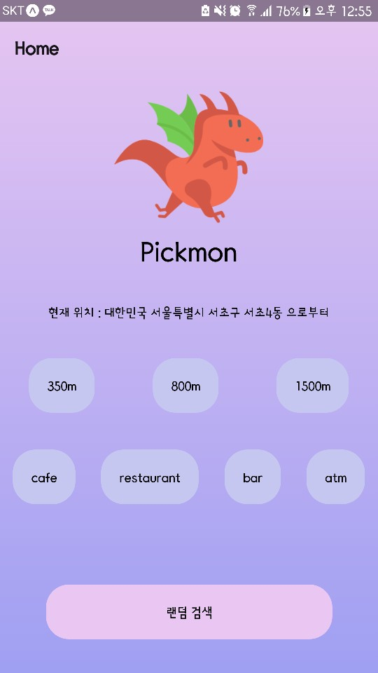
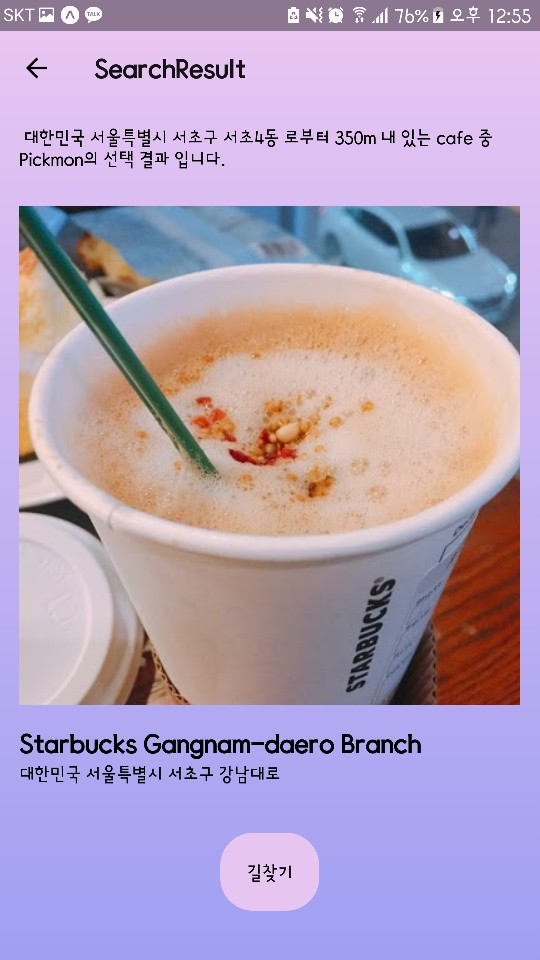
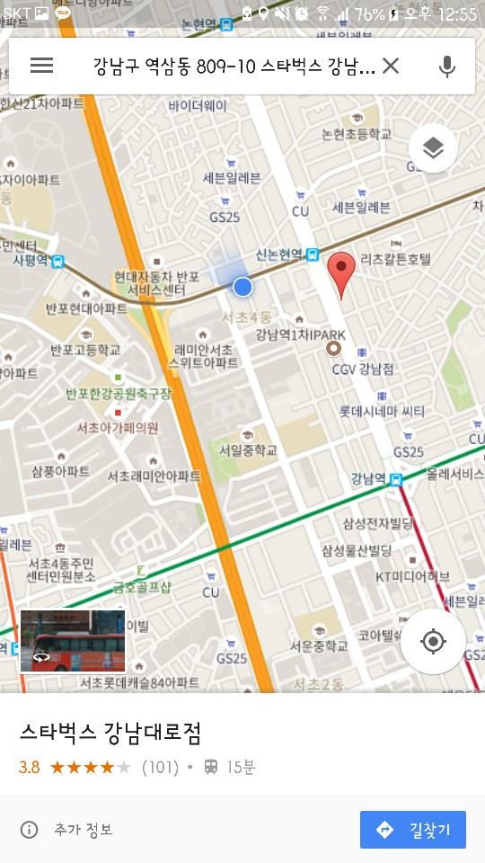

# Introduction
어디를 가야할지 고민이 될 때, pickmon이 랜덤으로 한 곳을 선별해주는 Android 전용 앱입니다. . <br />
https://play.google.com/store/apps/details?id=com.jeonjeong.pickmon   <br/>
<p style="text-align: center;">



</p>
<br/>

예) 현재 위치로 부터 800미터 내 cafe 중 랜덤으로 한 곳 검색 후 길찾기


# Requirements
* Google Maps Geocoding API
* Google Places API
* Google Maps API

# Installation
```git clone https://github.com/yourchikorita/pickmon.git``` <br/>
expo XDE -> Open existing project <br/>
(https://expo.io)

Google Play 에 올리기
  1. app.json 파일에 package name 추가
``` 
android : {
"package" : "com.jeonjeong.pickmon"
}
```

 2. exp 추가
```
npm or yarn global add exp
exp:build android
exp:status android
```
 3. apk 획득 
 4. google play console 사이트에서 획득한 apk  등록
 5. 일정시간 심사 후 앱 출시

# Features
* Google Maps Geocoding API 를 이용하여 위도,경도를 한국어 주소로 변환
* Google Places API로 반경 몇 미터내 type별 place 정보를 불러옴
* Google Maps API  현재 위치부터 목적지 까지의 길찾기

# Client Side
* Babel을 통한 모던 자바스크립트(ES2015+)
* react-native
* expo

# Version Control
* git 

# Things to do
처음으로 구글 플레이에 앱을 등록해봐서 올리는 과정이 뜻밖의 고비였다(개인정보처리방안 부분), 또한 전반적인 UI, UX 도 아쉬운 부분이다. 조금씩 업데이트 해 나가겠다. 

* 가격대별 선택 기능 추가
* 전반적인 UX 향상
* 새로고침 기능 추가

# Developer
전은정

